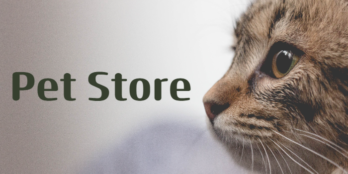
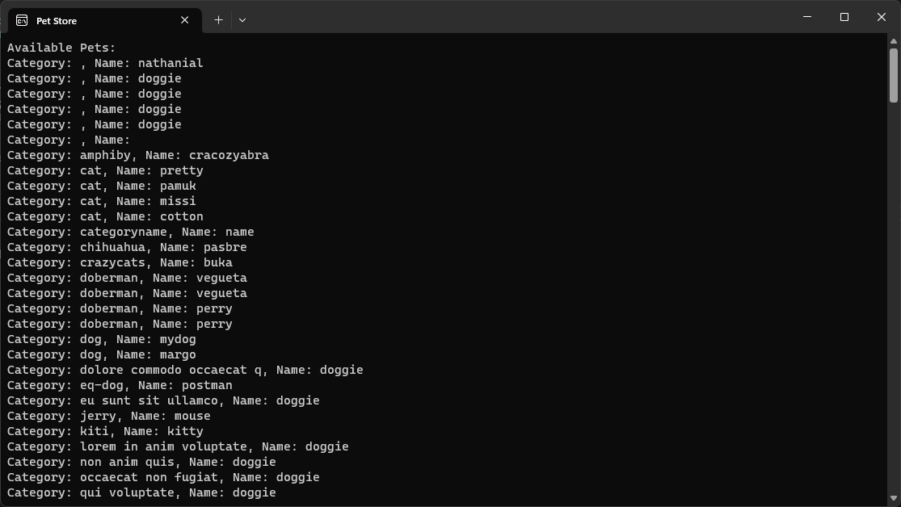

<h1 align="center">

</img>
</h1>

## About

#### A simple console app that retrieves all available Pets from the Swagger Pet Store, written with the aid of ChatGPT.

## Result

## ChatGPT Transcript

See Transcript [here]("./Documentation/chatgpt_transcript.html").
